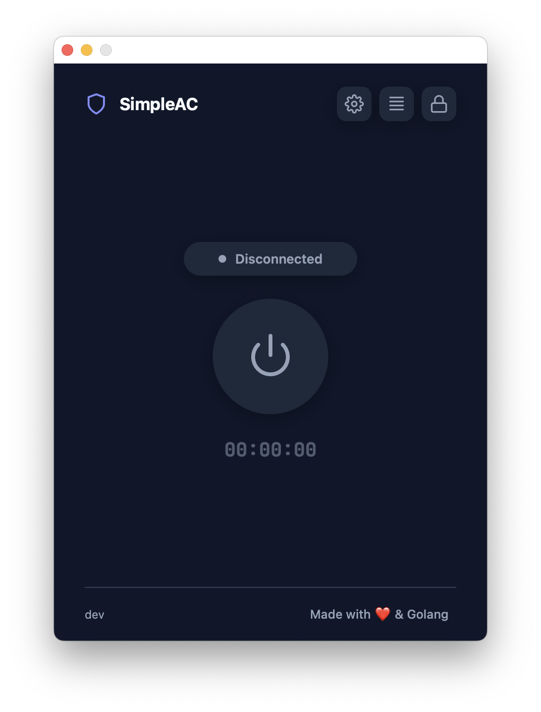

# SimpleAC

**SimpleAC** — это легковесная открытая графическая оболочка (wrapper) для командной строки **Cisco AnyConnect**. Она создана для того, чтобы сделать использование VPN более удобным, добавляя удобное подключение в один клик с шифрованием вашей конфигурации.


<p align="center">
  
</p>

<p align="center">
  <a href="SCREENSHOTS.md"><b>View all screenshots / Посмотреть все скриншоты</b></a>
</p>


[Russian](#russian) | [English](#english)

---

<a name="english"></a>
## English

**SimpleAC** is a lightweight open-source GUI wrapper for the **Cisco AnyConnect CLI**. It is designed to make VPN usage more convenient and one-click connection with full encryption of your configuration (AES-256).


### ⚖️ Legal Disclaimer
- **Not a modification**: SimpleAC does NOT modify, patch, or interfere with the Cisco AnyConnect binary or its internal protocols.
- **Wrapper only**: This application acts solely as a GUI shell that executes standard CLI commands (e.g., `vpn connect`, `vpn disconnect`) provided by the official Cisco AnyConnect installation.
- **No affiliation**: SimpleAC is not affiliated with, endorsed by, or sponsored by Cisco Systems, Inc. "AnyConnect" is a trademark of Cisco Systems, Inc.
- **"As Is"**: The software is provided "as is", without warranty of any kind. Use it at your own risk.

### 🚀 Features
- **2FA Support**: Built-in TOTP (Google Authenticator) support.
- **Connection Timer**: See exactly how long you've been connected.
- **Lightweight**: Minimal resource usage compared to the official GUI.

### 🛠 Installation
SimpleAC requires the official Cisco AnyConnect client to be installed on your system.

#### From Releases (Recommended)
1. Go to the [Releases](https://github.com/fadinflame/simple-ac/releases) page.
2. Download the latest version for your OS (macOS or Windows).
3. Run the application.

#### Building from Source
If you want to build it yourself, you'll need [Go](https://go.dev/) and [Wails](https://wails.io/) installed.
```bash
git clone https://github.com/fadinflame/simple-ac.git
cd simple-ac
wails build
```

### ⚙️ Configuration
The app expects the Cisco AnyConnect CLI to be located at:
- **macOS/Linux**: `/opt/cisco/anyconnect/bin/vpn`
- **Windows**: `C:\Program Files (x86)\Cisco\Cisco AnyConnect Secure Mobility Client\vpncli.exe`

In the settings, provide your:
- Server Address
- Group
- Username & Password
- (Optional) TOTP Secret for 2FA

---

<a name="russian"></a>
## Russian (RU)

**SimpleAC** — это легкая графическая оболочка (wrapper) с открытым исходным кодом для **Cisco AnyConnect CLI**. Она упрощает управление VPN, предоставляя удобное подключение в один клик. Основной упор сделан на простоту использования и полную безопасность данных: ваша конфигурация и учетные данные защищены шифрованием **AES-256**.


### ⚖️ Юридическая информация
- **Не модификация**: SimpleAC НЕ модифицирует, не патчит и не вмешивается в работу бинарных файлов Cisco AnyConnect или их внутренние протоколы.
- **Только обертка**: Это приложение работает исключительно как графическая оболочка, вызывающая стандартные команды CLI (например, `vpn connect`, `vpn disconnect`), предоставляемые официальной установкой Cisco AnyConnect.
- **Никакой аффилиации**: SimpleAC не связан, не поддерживается и не спонсируется компанией Cisco Systems, Inc. "AnyConnect" является торговой маркой Cisco Systems, Inc.
- **"Как есть"**: Программное обеспечение предоставляется по лицензии MIT "как есть", без каких-либо гарантий. Используйте на свой страх и риск.

### 🚀 Особенности
- **Поддержка 2FA**: Встроенная поддержка TOTP (Google Authenticator).
- **Таймер подключения**: Точно отображает время вашего нахождения в сети.
- **Легкость**: Минимальное потребление ресурсов по сравнению с официальным GUI.

### 🛠 Установка
Для работы SimpleAC необходимо, чтобы в вашей системе уже был установлен официальный клиент Cisco AnyConnect.

#### Из разделов Releases (Рекомендуется)
1. Перейдите на страницу [Releases](https://github.com/fadinflame/simple-ac/releases).
2. Скачайте последнюю версию для вашей ОС (macOS или Windows).
3. Запустите приложение.

#### Сборка из исходного кода
Если вы хотите собрать приложение самостоятельно, вам понадобятся установленные [Go](https://go.dev/) и [Wails](https://wails.io/).
```bash
git clone https://github.com/fadinflame/simple-ac.git
cd simple-ac
wails build
```

### ⚙️ Конфигурация
Приложение ожидает, что CLI Cisco AnyConnect находится по путям:
- **macOS/Linux**: `/opt/cisco/anyconnect/bin/vpn`
- **Windows**: `C:\Program Files (x86)\Cisco\Cisco AnyConnect Secure Mobility Client\vpncli.exe`

В настройках укажите:
- Адрес сервера (Server Address)
- Группу (Group)
- Имя пользователя и пароль (Username & Password)
- (Опционально) TOTP Secret для 2FA

---

### 📄 License
This project is licensed under the **MIT License**. See the [LICENSE](LICENSE) file for details.
