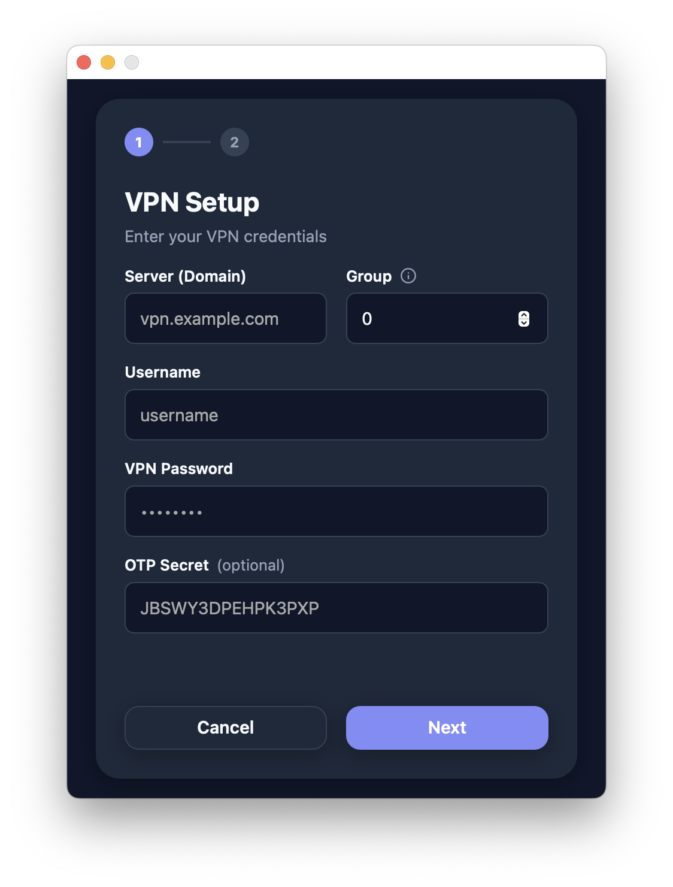
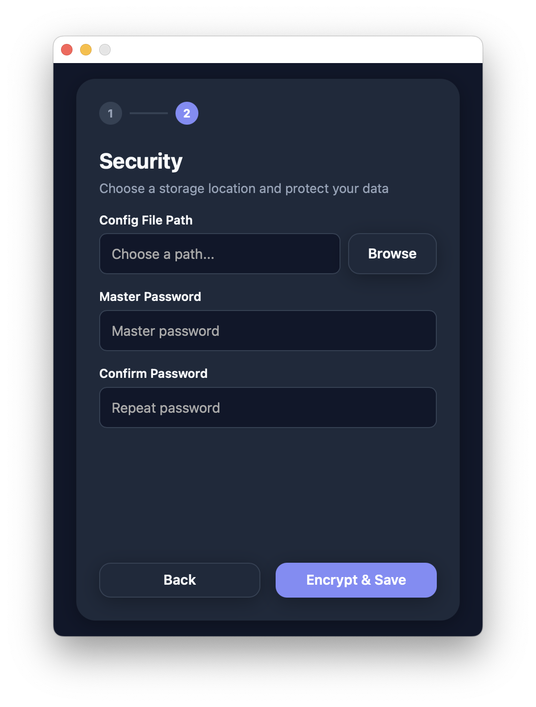
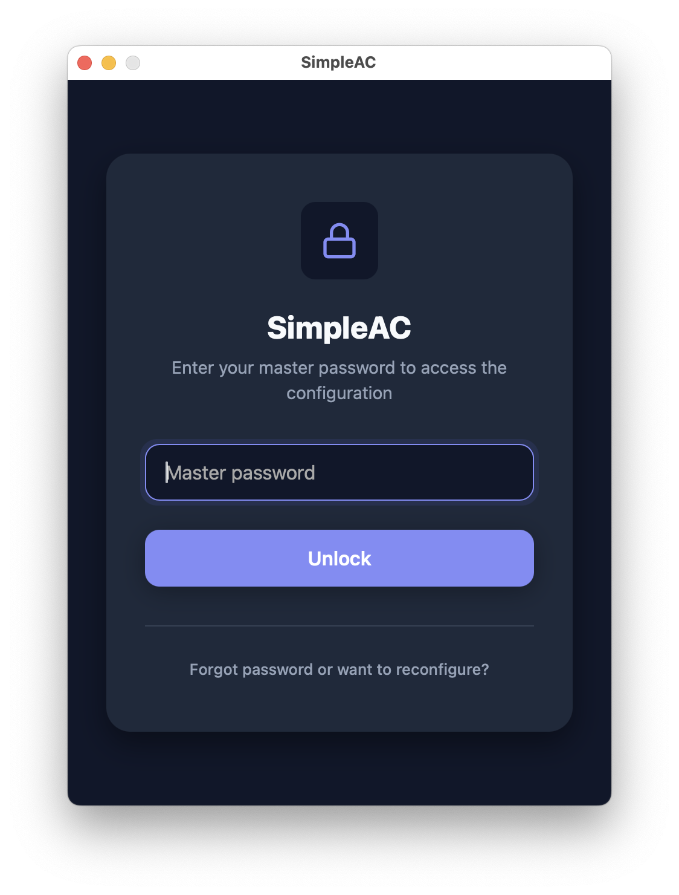
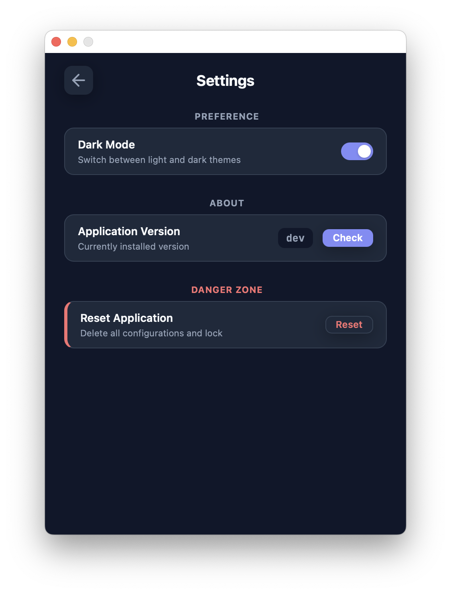
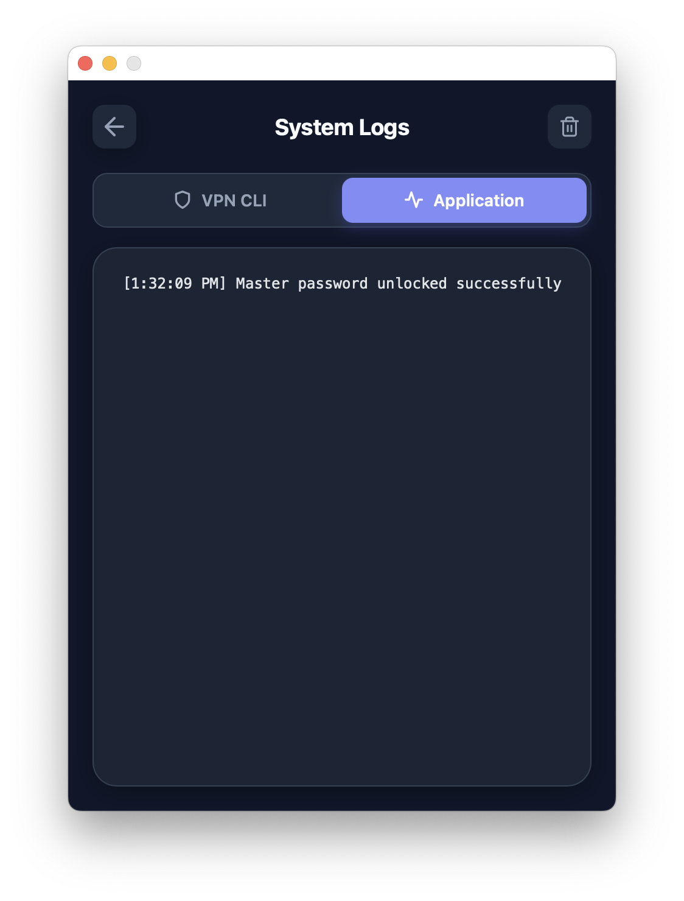

# Screenshots / Скриншоты

This page shows the application interface and the configuration process.
Эта страница показывает интерфейс приложения и процесс настройки.

---

### main.png
Main application dashboard / Главный дашборд приложения

---

### setup1.png
Initial server configuration / Начальная настройка сервера

---

### setup2.png
Authentication settings (TOTP/2FA) / Настройки аутентификации (TOTP/2FA)

---

### password.png
Secure credential management / Безопасное управление учетными данными

---

### settings.png
Application preferences / Настройки приложения

---

### logs.png
Real-time connection logs / Логи подключения в реальном времени

